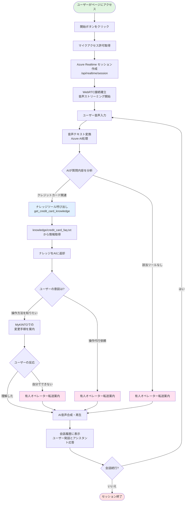

# AI カスタマーサポート - 音声対話システム

音声を使って Azure OpenAI Realtime API と対話するカスタマーサポートシステムのプロトタイプ（POC）です。ブラウザから WebRTC を使って Azure OpenAI に直接接続し、リアルタイムでの音声対話を実現します。

## 🎯 概要

このアプリケーションは、以下の機能を提供します：

- **音声対話**: ブラウザのマイクを使用してAIカスタマーサポートと日本語で対話
- **ツールベースナレッジシステム**: AIが質問内容に応じて適切なナレッジツールを呼び出し
- **クレジットカード情報Q&A**: クレジットカード情報の変更方法などをガイド（操作は行わない）
- **リアルタイム処理**: WebRTC を使用した低遅延の音声通信
- **会話履歴表示**: ユーザーの音声入力とAI応答をリアルタイムでテキスト表示
- **人工オペレーター転送**: 操作代行依頼や対応できない問い合わせは有人オペレーターへの転送を案内
- **拡張可能な設計**: 新しいナレッジ領域を簡単に追加できるモジュラー設計
- **Token使用統計**: リアルタイムでToken使用量とコストを追跡・表示

## 🚀 クイックスタート

### 前提条件

- Node.js 18.x 以上
- Azure OpenAI リソース（Realtime API 対応）

### セットアップ

1. **リポジトリのクローン**
   ```bash
   git clone <repository-url>
   cd poc-voice-live-api-ai-agent
   ```

2. **依存関係のインストール**
   ```bash
   npm install
   ```

3. **環境変数の設定**

   `.env.local.example` を `.env.local` にコピーして必要な値を設定：

   ```bash
   cp .env.local.example .env.local
   ```

   **必須の環境変数：**
   ```
   AZURE_OPENAI_ENDPOINT=https://<your-resource>.openai.azure.com
   AZURE_OPENAI_API_KEY=<your-api-key>
   ```

   **オプションの環境変数：**
   ```
   AZURE_OPENAI_DEPLOYMENT=gpt-realtime
   NEXT_PUBLIC_AZURE_OPENAI_REGION=eastus2
   ```

4. **開発サーバーの起動**
   ```bash
   npm run dev
   ```

5. **ブラウザでアクセス**

   http://localhost:3000/realtime にアクセスして音声対話を開始

## 📱 使用方法

1. `/realtime` ページにアクセス
2. 「開始」ボタンをクリックしてマイクアクセスを許可
3. AIカスタマーサポートと日本語で対話
4. クレジットカード情報変更などのお問い合わせを行う
5. 画面下部の「Token 使用統計」パネルで使用状況を確認

### 対応可能な問い合わせ

AIカスタマーサポートは以下の問い合わせに対応します：

1. **クレジットカード情報変更**
   - 住所変更
   - 電話番号変更
   - メールアドレス変更

2. **その他の問い合わせ**
   - 上記以外の問い合わせは、有人オペレーターへの転送をご案内します

## 📊 Token使用統計機能

アプリケーションには、リアルタイムでToken使用量とコストを追跡する機能が組み込まれています。

### 機能概要

- **リアルタイム追跡**: 各対話後、即座にToken使用量を表示
- **詳細な分類**: Text Tokens と Audio Tokens を個別に追跡
- **自動コスト計算**: Azure公式価格に基づいた推定コストを表示
- **履歴表示**: 各応答のToken使用詳細を時系列で確認可能

### 表示される情報

#### 1. サマリー統計
- **入力 Tokens**: ユーザーの音声とシステム指令で消費されたTokens
  - テキスト Tokens: システム指令、ツール定義、対話履歴
  - オーディオ Tokens: ユーザーの音声入力
- **出力 Tokens**: AIの応答で生成されたTokens
  - テキスト Tokens: AIの文字応答、ツール呼び出し
  - オーディオ Tokens: AIの音声合成
- **キャッシュ Tokens**: 再利用されたTokens（コスト削減）
  - システム指令やツール定義がキャッシュされます

#### 2. コスト推定
Azure OpenAI GPT-realtime の公式価格（100万Tokens当たり）：
- テキスト入力: ¥598.03
- オーディオ入力: ¥4,784.17
- キャッシュ入力: ¥59.81（約90%のコスト削減！）
- テキスト出力: ¥2,392.09
- オーディオ出力: ¥9,568.33

#### 3. 応答履歴
各応答の詳細を展開表示：
- 入力/出力の内訳（Text/Audio別）
- タイムスタンプ
- 個別のコスト推定

### Token使用の最適化

**キャッシュの活用**:
- 初回対話: システム指令とツール定義がキャッシュされます
- 2回目以降: キャッシュされたTokensは通常価格の約10%で利用可能
- 自動最適化: Azureが自動的にキャッシュ戦略を管理

**推奨事項**:
- システム指令は安定させる（頻繁な変更を避ける）
- 長い対話の場合、定期的にセッションをリセット
- 不要な対話履歴の蓄積を避ける

### 注意事項

- 表示される推定コストは参考値です
- 正確な課金額は Azure Portal で確認してください
- Portal の `processed_prompt_tokens` と `generated_completion_tokens` が実際の課金対象です

## 🏗️ アーキテクチャ

### 接待フロー

以下は、AI カスタマーサポートの接待機制を示すフローチャートです：



### ディレクトリ構成

```
app/
├── api/
│   ├── functions/                    # AI が呼び出す機能エンドポイント
│   │   └── change_credit_card_info/  # クレジットカード情報変更
│   └── realtime/session/             # Azure Realtime セッション作成
├── realtime/                         # 音声対話UI
├── layout.tsx
└── page.tsx
```

### データフロー

1. **セッション作成**: クライアントが `/api/realtime/session` でAzureセッションを作成
2. **WebRTC接続**: ブラウザとAzure間で音声ストリーミング接続を確立
3. **音声処理**: ユーザーの音声 → Azure AI → 機能呼び出し → レスポンス → 音声合成
4. **機能実行**: AIが必要に応じてローカルAPI（クレジットカード情報変更）を呼び出し

## 🛠️ 開発

### 利用可能なコマンド

```bash
npm run dev      # 開発サーバー起動
npm run build    # 本番ビルド
npm start        # 本番サーバー起動
npm run lint     # ESLint実行
```

### API エンドポイント

- `GET /api/realtime/session` - Azure Realtime セッション作成
- `POST /api/functions/change_credit_card_info` - クレジットカード情報変更
  - パラメータ: `cardNumber`（カード番号下4桁）、`changeType`（変更種別: address/phone/email）、`newValue`（新しい値）

### 技術スタック

- **フロントエンド**: Next.js 14+, React 18.2, TypeScript
- **音声技術**: WebRTC, Web Audio API
- **AI**: Azure OpenAI Realtime API (GPT Realtime)
- **デプロイ**: Next.js アプリケーション

## 🔧 設定

### Azure OpenAI設定

1. Azure OpenAI リソースを作成
2. `gpt-realtime` モデルをデプロイ
3. API キーとエンドポイントを取得
4. `.env.local` に設定

## 🚨 注意事項

- **本番環境**: HTTPS必須（WebRTC要件）
- **APIキー**: 本番環境ではAPIキーを適切に保護してください
- **ブラウザ互換性**: WebRTC対応ブラウザが必要
- **マイクアクセス**: ユーザーのマイクアクセス許可が必要

## 📄 ライセンス

このプロジェクトはPOC（概念実証）として作成されています。

## 🤝 貢献

1. Fork the Project
2. Create your Feature Branch (`git checkout -b feature/AmazingFeature`)
3. Commit your Changes (`git commit -m 'Add some AmazingFeature'`)
4. Push to the Branch (`git push origin feature/AmazingFeature`)
5. Open a Pull Request